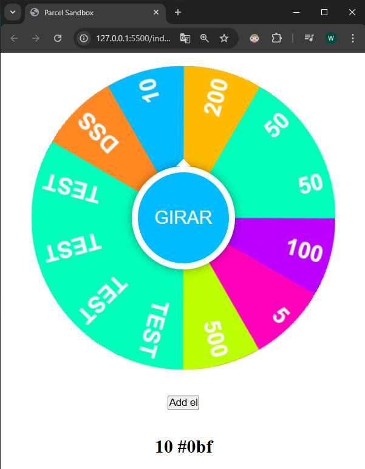

# NOTE:

Proyecto para realizar un sorteo en html con canvas.



Url del proyecto original: https://codesandbox.io/p/sandbox/wheel-of-fortune-1475d

Source translated.

Sample names:

- Mairead
- Jalon
- Jude
- Gizelle
- Zayla
- Dov
- Garrett
- Azriel
- Trey
- Clyde
- Dex
- Ayra
- Kamaya
- Bricen
- Kaylei
- Loki
- Ivette
- Malcom
- Ezrah
- Jenika
- Jesiah
- Gilberto
- Evaline
- Kellen
- Khristian
- Dania
- Mateo
- Karas
- Sirena
- Lissette
- Tressa
- Michelle
- Calissa
- Ansleigh
- Maxine
- David
- Lovely
- Rhyan
- Rey
- Cannon
- Roshan
- Omere
- Simeon
- Taylan
- Karl
- Tyrese
- Mali
- Abella
- Abriella
- Mervin
- Talia
- Kori
- Daisy
- Cayleigh
- Cameron
- Abdallah
- Ocean
- Laine
- Domonic
- Ronaldo

```ts
// Definición de tipo para los elementos de la ruleta
type Elemento = {
  color: string;
  label: string;
};

// Arreglo de elementos de la ruleta
const elementos: Elemento[] = [
  { color: '#f82', label: 'dss' },
  { color: '#0bf', label: '10' },
  { color: '#fb0', label: '200' },
  { color: '#0fb', label: '50' },
  { color: '#0fb', label: '50' },
  { color: '#b0f', label: '100' },
  { color: '#f0b', label: '5' },
  { color: '#bf0', label: '500' },
];

// Función para generar un número aleatorio entre dos valores
const rand = (min: number, max: number): number => Math.random() * (max - min) + min;

// Referencias a elementos del DOM
const spinElement = document.querySelector('#spin') as HTMLButtonElement;
const canvas = document.querySelector('#wheel') as HTMLCanvasElement;
const context = canvas.getContext('2d') as CanvasRenderingContext2D;
const resultText = document.querySelector('#resultText') as HTMLDivElement;

const dia = context.canvas.width;
const rad = dia / 2;
const PI = Math.PI;
const TAU = 2 * PI;

const friction = 0.991; // Fricción: 0.995=suave, 0.99=media, 0.98=dura
let velocidadAngular = 0; // Velocidad angular
let ang = 0; // Ángulo en radianes

// Función para obtener el índice del elemento actual basado en el ángulo
const getIndex = (len: number): number => Math.floor(len - (ang / TAU) * len) % len;

// Dibuja un sector de la ruleta
function drawSector(elementItem: Elemento, index: number): void {
  let arcoLocal = TAU / elementos.length;
  const ang = arcoLocal * index;
  context.save();

  // Dibuja el color del sector
  context.beginPath();
  context.fillStyle = elementItem.color;
  context.moveTo(rad, rad);
  context.arc(rad, rad, rad, ang, ang + arcoLocal);
  context.lineTo(rad, rad);
  context.fill();

  // Dibuja el texto
  context.translate(rad, rad);
  context.rotate(ang + arcoLocal / 2);
  context.textAlign = 'right';
  context.fillStyle = '#fff';
  context.font = 'bold 30px sans-serif';
  context.fillText(elementItem.label.toUpperCase(), rad - 10, 10);

  context.restore();
}

// Rota la ruleta y actualiza el elemento seleccionado
function rotate(): void {
  const elementoSelecionado = elementos[getIndex(elementos.length)];
  context.canvas.style.transform = `rotate(${ang - PI / 2}rad)`;
  spinElement.textContent = !velocidadAngular ? 'GIRAR' : elementoSelecionado.label.toUpperCase();
  spinElement.style.background = elementoSelecionado.color;
  if (!velocidadAngular) {
    console.log('Elemento sorteado -> ' + elementoSelecionado.label.toUpperCase());
    resultText.textContent = elementoSelecionado.label.toUpperCase();
  }
}

// Controla la rotación de la ruleta en cada cuadro de animación
function frame(): void {
  if (!velocidadAngular) return;
  velocidadAngular *= friction; // Decrementa la velocidad por la fricción
  if (velocidadAngular < 0.002) velocidadAngular = 0; // Detiene la rotación
  ang += velocidadAngular; // Actualiza el ángulo
  ang %= TAU; // Normaliza el ángulo
  rotate();
}

// Motor de la animación
function engine(): void {
  frame();
  requestAnimationFrame(engine);
}

// Inicializa la ruleta y configura los eventos
function init(): void {
  elementos.forEach(drawSector);
  engine(); // Inicia la animación del motor
  spinElement.addEventListener('click', () => {
    if (!velocidadAngular) velocidadAngular = rand(0.25, 0.45);
  });
}

// Agrega un nuevo elemento a la ruleta
function addElement(): void {
  console.log('Agregar elemento');
  elementos.push({
    color: '#0fb',
    label: 'test',
  });
  console.log(elementos.length);
  elementos.forEach(drawSector);
}

// Inicialización
init();
```
